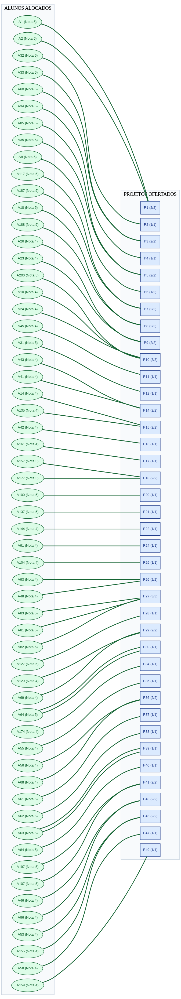

# Projeto02-TAG
Projeto 2 - Teoria e Aplicação de Grafos

## Estrutura do Projeto

```text
Projeto02-TAG/
│
├── include/           # Arquivos de cabeçalho (.hpp)
│   ├── graph.hpp
│   ├── project.hpp
│   └── student.hpp
│
├── src/               # Código-fonte (.cpp)
│   ├── graph.cpp
│   ├── main.cpp
│   ├── project.cpp
│   └── student.cpp
│
├── docs/              # Documentações e arquivos de entrada
│   └── entradaProj2.26TAG.txt
|   └── Grafo_Alocacao_Final.png
|   └── TAG_Projeto_2.pdf
│
|   Projeto02_TAG.ipynb
├── Makefile           # Script de automação da compilação
└── README.md          # Este arquivo de instruções
```

## Como Executar
### 1. Clonar o repositório

```bash
git clone https://github.com/JotaG09/Projeto02-TAG.git
cd Projeto02-TAG
```

### 2. Compilar o Projeto
```bash
make
```

### 3. Compilar e Executar Direto

```bash
make run
```

### 4. Limpar arquivos temporários

```bash
make clean
```

```bash

============================================================================================
                      MATRIZ FINAL DE EMPARELHAMENTOS (GANHOS / PERDAS)                     
============================================================================================

Aluno       Proj. Alocado  Classificação do Aluno (No Projeto)        Classificação do Projeto (No Aluno)
----------------------------------------------------------------------------------------------------
A1          P1             1º (Top 1 de 13 na lista P1)                1º escolha do Aluno
A2          P1             2º (Top 2 de 13 na lista P1)                1º escolha do Aluno
A8          P6             1º (Top 1 de 7 na lista P6)                 1º escolha do Aluno
A10         P10            3º (Top 3 de 21 na lista P10)               3º escolha do Aluno
A14         P15            2º (Top 2 de 11 na lista P15)               3º escolha do Aluno
A18         P8             2º (Top 2 de 25 na lista P8)                1º escolha do Aluno
A23         P9             2º (Top 2 de 19 na lista P9)                1º escolha do Aluno
A24         P10            4º (Top 4 de 21 na lista P10)               1º escolha do Aluno
A26         P9             3º (Top 3 de 19 na lista P9)                2º escolha do Aluno
A31         P12            1º (Top 1 de 8 na lista P12)                1º escolha do Aluno
A32         P2             2º (Top 2 de 10 na lista P2)                1º escolha do Aluno
A33         P3             1º (Top 1 de 11 na lista P3)                1º escolha do Aluno
A34         P4             2º (Top 2 de 23 na lista P4)                1º escolha do Aluno
A35         P5             1º (Top 1 de 19 na lista P5)                1º escolha do Aluno
A41         P14            2º (Top 2 de 8 na lista P14)                1º escolha do Aluno
A42         P16            1º (Top 1 de 2 na lista P16)                1º escolha do Aluno
A43         P14            3º (Top 3 de 8 na lista P14)                2º escolha do Aluno
A45         P11            1º (Top 1 de 5 na lista P11)                1º escolha do Aluno
A46         P43            2º (Top 2 de 12 na lista P43)               1º escolha do Aluno
A48         P26            1º (Top 1 de 7 na lista P26)                1º escolha do Aluno
A53         P45            2º (Top 2 de 10 na lista P45)               3º escolha do Aluno
A55         P35            1º (Top 1 de 5 na lista P35)                1º escolha do Aluno
A56         P36            1º (Top 1 de 8 na lista P36)                1º escolha do Aluno
A58         P47            2º (Top 2 de 11 na lista P47)               2º escolha do Aluno
A60         P3             2º (Top 2 de 11 na lista P3)                1º escolha do Aluno
A61         P37            1º (Top 1 de 14 na lista P37)               1º escolha do Aluno
A62         P38            1º (Top 1 de 20 na lista P38)               1º escolha do Aluno
A63         P39            1º (Top 1 de 9 na lista P39)                1º escolha do Aluno
A64         P30            4º (Top 4 de 24 na lista P30)               1º escolha do Aluno
A68         P36            2º (Top 2 de 8 na lista P36)                1º escolha do Aluno
A69         P29            3º (Top 3 de 12 na lista P29)               2º escolha do Aluno
A81         P27            4º (Top 4 de 24 na lista P27)               1º escolha do Aluno
A82         P27            5º (Top 5 de 24 na lista P27)               2º escolha do Aluno
A83         P27            6º (Top 6 de 24 na lista P27)               1º escolha do Aluno
A84         P40            2º (Top 2 de 22 na lista P40)               2º escolha do Aluno
A85         P5             4º (Top 4 de 19 na lista P5)                1º escolha do Aluno
A91         P24            4º (Top 4 de 18 na lista P24)               1º escolha do Aluno
A93         P26            2º (Top 2 de 7 na lista P26)                1º escolha do Aluno
A96         P43            4º (Top 4 de 12 na lista P43)               1º escolha do Aluno
A100        P20            3º (Top 3 de 18 na lista P20)               3º escolha do Aluno
A104        P25            3º (Top 3 de 8 na lista P25)                3º escolha do Aluno
A107        P41            1º (Top 1 de 6 na lista P41)                1º escolha do Aluno
A117        P7             1º (Top 1 de 15 na lista P7)                1º escolha do Aluno
A127        P28            2º (Top 2 de 14 na lista P28)               1º escolha do Aluno
A129        P29            4º (Top 4 de 12 na lista P29)               2º escolha do Aluno
A135        P15            6º (Top 6 de 11 na lista P15)               1º escolha do Aluno
A137        P21            2º (Top 2 de 13 na lista P21)               2º escolha do Aluno
A144        P22            1º (Top 1 de 4 na lista P22)                1º escolha do Aluno
A155        P45            6º (Top 6 de 10 na lista P45)               1º escolha do Aluno
A157        P18            2º (Top 2 de 14 na lista P18)               3º escolha do Aluno
A159        P49            1º (Top 1 de 9 na lista P49)                3º escolha do Aluno
A161        P17            3º (Top 3 de 6 na lista P17)                2º escolha do Aluno
A174        P34            7º (Top 7 de 23 na lista P34)               1º escolha do Aluno
A177        P18            3º (Top 3 de 14 na lista P18)               3º escolha do Aluno
A187        P7             2º (Top 2 de 15 na lista P7)                1º escolha do Aluno
A188        P8             5º (Top 5 de 25 na lista P8)                1º escolha do Aluno
A197        P41            2º (Top 2 de 6 na lista P41)                1º escolha do Aluno
A200        P10            1º (Top 1 de 21 na lista P10)               2º escolha do Aluno
----------------------------------------------------------------------------------------------------
Total de alunos alocados com sucesso: 58 de 200 candidatos.
```

## Grafo final de emparelhamento:





